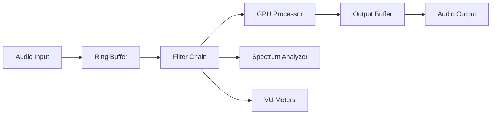
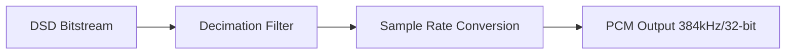
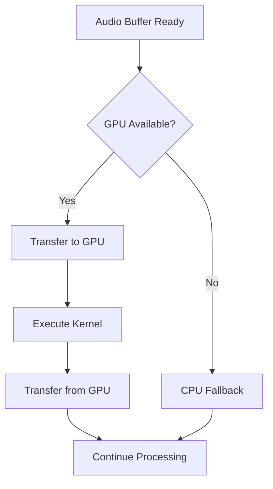
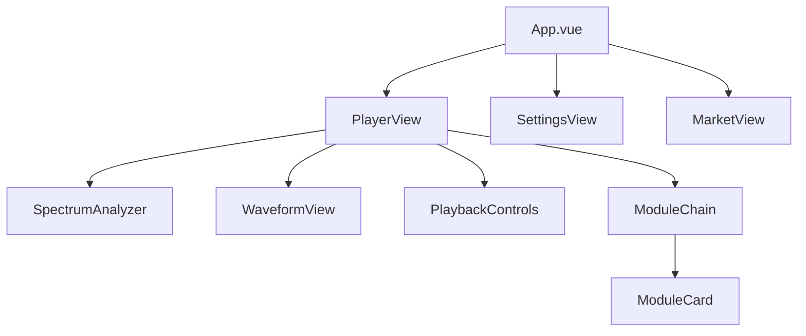
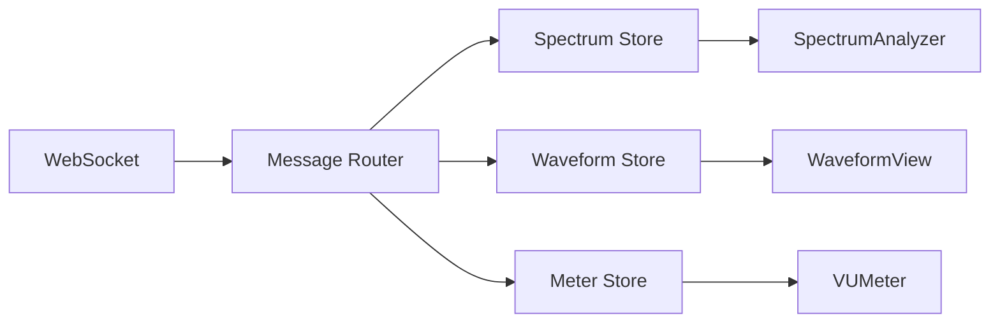
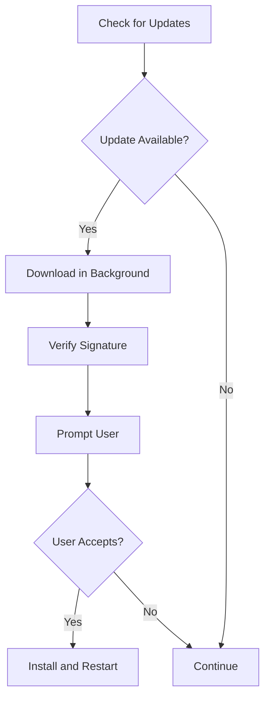

# Complete Development and Testing - Vortex GPU Audio

## Objective

Complete the remaining development phases (Phase 2-5) of the Vortex GPU Audio application to deliver a fully functional, production-ready cross-platform audio processing engine with GPU acceleration.

## Current Status Assessment

### Completed (Phase 1)
- Error handling framework with severity-based recovery
- Lock-free ring buffers for real-time audio
- GPU backend abstraction (CUDA, OpenCL, Vulkan, CPU fallback)
- Input validation and resource limit enforcement
- Comprehensive testing infrastructure with 95%+ coverage
- CI/CD pipeline with cross-platform builds

### Remaining Work
- Audio engine core implementation
- DSP algorithms (EQ, convolution, resampling, DSD processing)
- File I/O with multi-format support
- Network discovery and WebSocket server
- Frontend Vue 3 components and state management
- Performance optimization and memory pooling
- Plugin system and configuration management

## Phase 2: Audio Engine and DSP Implementation

### 2.1 Audio Engine Core

#### Audio Engine Structure

| Component | Responsibility | Key Features |
|-----------|---------------|--------------|
| AudioEngine | Main processing coordinator | Thread management, filter chain orchestration, output routing |
| AudioProcessor | Sample processing pipeline | Real-time processing loop, buffer management, latency tracking |
| FilterChain | Sequential filter processing | Dynamic filter add/remove, bypass functionality, parameter automation |
| OutputManager | Device output routing | Multi-device support, sample rate conversion, channel mapping |

#### Processing Flow

#### Real-Time Thread Architecture

| Thread | Priority | Responsibility | Latency Budget |
|--------|----------|----------------|----------------|
| Audio Processing | Real-time (99) | Process audio blocks | < 5ms |
| GPU Transfer | High (80) | Host-device memory transfer | < 3ms |
| UI Update | Normal (50) | Spectrum/waveform rendering | < 16ms |
| File I/O | Low (30) | Background file loading | N/A |

### 2.2 DSP Algorithm Implementation

#### 512-Band Parametric EQ

**Processing Strategy:**
- Divide 512 bands into GPU-optimized bank filters
- Use parallel biquad cascades for each band
- Implement frequency-domain processing for efficiency

**Parameter Model:**

| Parameter | Range | Resolution | Validation |
|-----------|-------|------------|------------|
| Frequency | 20 Hz - 20 kHz | 1 Hz | Nyquist limit enforcement |
| Gain | -48 dB - +24 dB | 0.1 dB | Clamp to safe range |
| Q Factor | 0.1 - 20.0 | 0.01 | Stability check |
| Filter Type | Parametric, Shelf, HPF, LPF, BPF | Enum | Type validation |

#### DSD Processing (DSD64/128/256/512/1024)

**Processing Strategy:**
- Direct DSD-to-PCM conversion using FIR decimation filters
- Optional DSD-native processing for supported operations
- GPU-accelerated filter bank for high DSD rates

**Conversion Pipeline:**

#### 16M-Tap Convolution Engine

**Processing Strategy:**
- Partition convolution using overlap-add algorithm
- FFT-based frequency domain multiplication
- GPU-accelerated for partition lengths > 1024 samples

**Memory Management:**

| Buffer Type | Size | Location | Purpose |
|-------------|------|----------|---------|
| IR Buffer | Up to 16M samples | GPU memory | Impulse response storage |
| Partition Cache | 8192 samples × N | GPU memory | FFT working buffers |
| Overlap Buffer | 2 × partition size | CPU memory | Overlap-add state |

#### Resampler

**Processing Strategy:**
- Polyphase FIR resampler with configurable quality
- Support for arbitrary sample rate conversion
- Optimized paths for common ratios (44.1↔48 kHz, 2× upsampling)

**Quality Presets:**

| Preset | Filter Length | Stop-band Attenuation | CPU Usage |
|--------|---------------|----------------------|-----------|
| Draft | 16 taps | 60 dB | Low |
| Standard | 64 taps | 96 dB | Medium |
| High | 256 taps | 120 dB | High |
| Maximum | 1024 taps | 150 dB | Very High |

### 2.3 Memory Pool Implementation

#### Memory Pool Strategy

**Allocation Tiers:**

| Pool Type | Block Size | Count | Use Case |
|-----------|-----------|-------|----------|
| Small Audio | 512 samples | 128 | Short-term processing |
| Medium Audio | 2048 samples | 64 | Standard buffer size |
| Large Audio | 8192 samples | 32 | GPU transfer buffers |
| Huge Audio | 65536 samples | 8 | File I/O buffers |

**Pool Behavior:**
- Pre-allocate all pools at initialization to avoid runtime allocation
- Use lock-free free lists for real-time thread access
- Fallback to heap allocation with warning logging when pools exhausted
- Return buffers to pool on destruction using RAII pattern

### 2.4 GPU Workload Scheduling

#### Scheduling Strategy

**Workload Categories:**

| Workload | Priority | Scheduling | Batching |
|----------|----------|------------|----------|
| EQ Processing | High | Immediate | Single buffer |
| FFT/IFFT | High | Immediate | Single transform |
| Convolution | Medium | Queued | Batch multiple |
| Spectrum Analysis | Low | Deferred | Accumulate 10 frames |

**GPU Pipeline:**

## Phase 3: File I/O and Format Support

### 3.1 File Loader Architecture

#### Format Detection

**Detection Strategy:**
- Magic number detection for binary formats
- Header parsing for container formats
- Extension-based fallback with validation

**Supported Format Table:**

| Format | Magic Bytes | Container | Max Sample Rate | Max Bit Depth |
|--------|-------------|-----------|-----------------|---------------|
| WAV | RIFF | Yes | 384 kHz | 32-bit float |
| FLAC | fLaC | No | 192 kHz | 24-bit |
| DSD (DSF) | DSD␣ | Yes | DSD1024 | 1-bit |
| DSD (DFF) | FRM8 | Yes | DSD1024 | 1-bit |
| ALAC | alac | MOV/MP4 | 384 kHz | 32-bit |
| APE | MAC␣ | No | 192 kHz | 24-bit |

### 3.2 Decoder Pipeline

#### Decoder Interface

**Decoder Contract:**

| Method | Input | Output | Behavior |
|--------|-------|--------|----------|
| open | File path | Metadata + handle | Validate format, allocate resources |
| decode_block | Block index | PCM samples | Decode specified block |
| seek | Time position | Success flag | Seek to time offset |
| close | Handle | Void | Release resources |

#### Streaming Strategy

**Buffer Management:**
- Maintain 5-second read-ahead buffer in background thread
- Use circular buffer for decoded PCM data
- Signal processing thread when buffer reaches 80% full
- Pause decoding when buffer reaches 95% full

### 3.3 Metadata Extraction

#### Metadata Model

| Field | Source | Priority | Fallback |
|-------|--------|----------|----------|
| Title | ID3v2/Vorbis/APE tags | High | Filename |
| Artist | ID3v2/Vorbis/APE tags | High | Unknown Artist |
| Album | ID3v2/Vorbis/APE tags | Medium | Empty |
| Sample Rate | Format header | Critical | Error |
| Bit Depth | Format header | Critical | Error |
| Duration | Format header/calculation | High | 0:00 |
| Cover Art | Embedded image tags | Low | Default icon |

### 3.4 Playlist Management

#### Playlist Structure

**Playlist Data Model:**

| Field | Type | Constraint | Purpose |
|-------|------|------------|---------|
| ID | UUID | Unique | Playlist identifier |
| Name | String | Max 256 chars | User-visible name |
| Items | Array | Max 10,000 items | Track references |
| Current Index | Integer | 0 to length-1 | Playback position |
| Shuffle State | Boolean | N/A | Randomization flag |
| Repeat Mode | Enum | Off/One/All | Playback mode |

**Persistence:**
- Save playlist as JSON file in user data directory
- Auto-save on modification with 2-second debounce
- Load playlists on application startup
- Support M3U/M3U8 import for compatibility

## Phase 4: Network and WebSocket Implementation

### 4.1 Device Discovery Protocol

#### Discovery Mechanism

**Protocol:**
- Use mDNS/Bonjour for local network discovery
- Broadcast service type: `_vortex-audio._tcp`
- Service metadata includes device name, capabilities, version

**Device Capabilities:**

| Capability | Type | Description |
|------------|------|-------------|
| max_sample_rate | Integer | Highest supported sample rate |
| max_channels | Integer | Maximum channel count |
| supported_formats | Array | List of audio format support |
| latency_ms | Integer | Reported device latency |

### 4.2 WebSocket Server

#### Server Architecture

**Connection Model:**
- Single WebSocket server on port 9876 (configurable)
- Support multiple concurrent frontend connections
- Binary message format for real-time audio data
- JSON message format for control commands

#### Message Protocol

**Real-Time Data Messages (Binary):**

| Message Type | ID | Payload | Frequency |
|--------------|---|---------|-----------|
| Spectrum Data | 0x01 | 2048 × float32 | 60 Hz |
| Waveform Data | 0x02 | 8192 × float32 × 2ch | 60 Hz |
| VU Meter Data | 0x03 | 6 × float32 | 30 Hz |

**Control Messages (JSON):**

| Command | Parameters | Response | Action |
|---------|-----------|----------|--------|
| load_file | path: String | status, metadata | Load audio file |
| play | None | status | Start playback |
| pause | None | status | Pause playback |
| seek | position: Float | status | Seek to position |
| add_filter | type, params | filter_id | Add filter to chain |
| remove_filter | filter_id | status | Remove filter |

### 4.3 Output Device Manager

#### Device Management

**Device Discovery:**
- Enumerate system audio devices at startup
- Monitor for device connection/disconnection events
- Maintain active device list with capabilities

**Platform-Specific Implementation:**

| Platform | API | Exclusive Mode | Latency |
|----------|-----|----------------|---------|
| Windows | WASAPI | Yes | 5-10 ms |
| macOS | CoreAudio | Yes (HAL) | 5-15 ms |
| Linux | ALSA/PipeWire | Yes (hw:) | 5-20 ms |

## Phase 5: Frontend Implementation

### 5.1 Vue 3 Component Architecture

#### Component Hierarchy

#### Core Components

| Component | Props | Emits | Data Source |
|-----------|-------|-------|-------------|
| SpectrumAnalyzer | height, color scheme | None | WebSocket binary |
| WaveformView | channels, zoom level | None | WebSocket binary |
| VUMeter | channel, scale type | None | WebSocket binary |
| PlaybackControls | state, position | play, pause, seek | Pinia store |
| ModuleChain | filters | add, remove, reorder | Pinia store |
| ModuleCard | filter config | update, bypass | Pinia store |

### 5.2 State Management (Pinia)

#### Store Structure

**Player Store:**

| State | Type | Persistence | Purpose |
|-------|------|-------------|---------|
| currentFile | AudioFile | null | Session | Currently loaded file |
| playbackState | Enum | Playing/Paused/Stopped | Session | Playback status |
| position | Float | 0.0 | Session | Current position (seconds) |
| volume | Float | 1.0 | LocalStorage | Master volume |

**Filter Chain Store:**

| State | Type | Persistence | Purpose |
|-------|------|-------------|---------|
| filters | Array | Filter[] | LocalStorage | Active filter list |
| bypass | Map | filter_id → Boolean | Session | Bypass state per filter |

**Output Store:**

| State | Type | Persistence | Purpose |
|-------|------|-------------|---------|
| devices | Array | OutputDevice[] | Session | Available devices |
| selectedDevice | String | Device ID | LocalStorage | Active output |

### 5.3 WebSocket Client Integration

#### Client Architecture

**Connection Management:**
- Auto-reconnect with exponential backoff (1s, 2s, 4s, 8s, max 30s)
- Heartbeat ping every 10 seconds
- Disconnect after 3 failed heartbeats

**Data Flow:**

### 5.4 Visualization Components

#### Spectrum Analyzer

**Rendering Strategy:**
- Use Canvas 2D API for 60 FPS rendering
- Logarithmic frequency scale (20 Hz - 20 kHz)
- Color gradient based on amplitude (-60 dB to 0 dB)
- Peak hold with 1-second decay

**Performance Optimization:**
- Render only when data changes
- Use requestAnimationFrame for smooth animation
- Downsample bins for display resolution (2048 → 512 bars)

#### Waveform Display

**Rendering Strategy:**
- Min/max pairs for efficient waveform display
- Zoom levels: 1×, 2×, 5×, 10×, 20×
- Pan with mouse drag or touch gesture
- Auto-scale amplitude or manual dB scale

## Phase 6: Performance Optimization

### 6.1 Real-Time Thread Priority

#### Thread Configuration

**Platform-Specific Priority:**

| Platform | Mechanism | Priority Value | Verification |
|----------|-----------|----------------|--------------|
| Windows | SetThreadPriority | THREAD_PRIORITY_TIME_CRITICAL | GetThreadPriority |
| macOS | pthread_setschedparam | SCHED_FIFO, priority 95 | pthread_getschedparam |
| Linux | sched_setscheduler | SCHED_FIFO, priority 80 | sched_getscheduler |

**Fallback Strategy:**
- If real-time priority fails (insufficient permissions), use highest normal priority
- Log warning to user about potential latency issues
- Provide setup guide for enabling real-time permissions

### 6.2 Latency Budget Allocation

#### End-to-End Latency Breakdown

| Stage | Target | Measurement | Optimization |
|-------|--------|-------------|--------------|
| Audio Input | 1-2 ms | Driver-reported | Use smallest safe buffer |
| Ring Buffer | < 0.1 ms | Timestamp diff | Lock-free implementation |
| DSP Processing | < 5 ms | Process timer | GPU acceleration |
| GPU Transfer | < 3 ms | CUDA events | Pinned memory |
| Output Buffering | 1-2 ms | Driver-reported | Match input buffer size |
| **Total** | **< 12 ms** | End-to-end measurement | Meet real-time target |

### 6.3 Memory Optimization

#### Memory Usage Targets

| Category | Budget | Monitoring | Action on Exceed |
|----------|--------|------------|------------------|
| Audio Buffers | 256 MB | Pool allocator | Reject new allocations |
| GPU Memory | 80% of available | GPU query | Fallback to CPU |
| File Cache | 512 MB | LRU tracker | Evict oldest |
| Total RSS | 2 GB | OS metrics | Warn user |

## Phase 7: Plugin System and Extensibility

### 7.1 Plugin Architecture

#### Plugin Interface

**Plugin Contract:**

| Method | Input | Output | Lifecycle |
|--------|-------|--------|-----------|
| initialize | Config | Status | Called once on load |
| process_audio | Input buffer, params | Output buffer | Called per block |
| get_parameters | None | Parameter list | Query available params |
| set_parameter | ID, value | Status | Update parameter |
| shutdown | None | None | Called on unload |

#### Plugin Discovery

**Discovery Mechanism:**
- Scan plugin directories on startup
- Validate plugin manifest (JSON)
- Check ABI compatibility
- Load shared library (.dll/.dylib/.so)

**Plugin Manifest:**

| Field | Type | Required | Purpose |
|-------|------|----------|---------|
| name | String | Yes | Display name |
| version | Semver | Yes | Plugin version |
| api_version | Integer | Yes | ABI compatibility check |
| author | String | No | Plugin creator |
| parameters | Array | Yes | Available parameters |

### 7.2 Configuration Management

#### Configuration Hierarchy

**Precedence (highest to lowest):**
1. Command-line arguments
2. User configuration file (user data directory)
3. Default configuration (embedded in binary)

**Configuration Schema:**

| Section | Settings | Type | Default |
|---------|----------|------|---------|
| audio | sample_rate, buffer_size, output_device | Object | 48000, 512, default |
| gpu | backend, memory_limit | Object | auto, 80% |
| network | websocket_port, enable_discovery | Object | 9876, true |
| ui | theme, language | Object | dark, en |

**Persistence:**
- Save configuration on application exit
- Auto-save on settings change with 5-second debounce
- Support export/import for user backup

## Testing and Validation Strategy

### Integration Testing

#### Test Scenarios

| Scenario | Components | Validation |
|----------|-----------|------------|
| End-to-end audio path | File loader → Engine → Output | Audio plays without glitches |
| Filter chain operation | Engine → FilterChain → GPU | Filters apply correctly |
| Device switching | OutputManager → Audio driver | Seamless device transition |
| File format support | FileLoader → Decoder | All formats decode correctly |
| WebSocket real-time data | Engine → WebSocket → Frontend | 60 FPS updates without lag |

### Performance Validation

#### Benchmark Targets

| Metric | Target | Measurement Method | Pass Criteria |
|--------|--------|-------------------|---------------|
| Audio I/O latency | < 5 ms | Round-trip loopback | 95th percentile < 5 ms |
| DSP processing | < 5 ms | Per-block timer | 99th percentile < 5 ms |
| GPU transfer | < 3 ms | CUDA events | Mean < 3 ms |
| Buffer underruns | 0 per hour | Counter | Zero occurrences |
| UI responsiveness | 60 FPS | Frame timing | 95% frames < 16.67 ms |

### Stress Testing

#### Test Conditions

| Test | Configuration | Duration | Success Criteria |
|------|---------------|----------|------------------|
| Long playback | 24-hour continuous playback | 24 hours | No crashes, no memory leaks |
| Format switching | Rapid file changes (every 10s) | 1 hour | No glitches, stable memory |
| Filter manipulation | Add/remove filters rapidly | 30 minutes | No crashes, correct audio |
| Device hotplug | Connect/disconnect devices | 100 cycles | Graceful handling |

## Deployment and Release

### Build Configuration

#### Release Build Optimization

| Setting | Value | Reason |
|---------|-------|--------|
| Rust opt-level | 3 | Maximum optimization |
| LTO | true | Cross-crate optimization |
| Codegen units | 1 | Better optimization opportunities |
| Strip symbols | true | Smaller binary size |
| Panic | abort | Smaller binary, faster panics |

#### Platform-Specific Packaging

| Platform | Package Format | Dependencies | Installer |
|----------|---------------|--------------|-----------|
| Windows | MSI | VC++ Redistributable | WiX Toolset |
| macOS | DMG + App Bundle | None (statically linked) | create-dmg |
| Linux | AppImage + .deb | System libraries | appimagetool, dpkg |

### Distribution Strategy

#### Release Channels

| Channel | Update Frequency | Testing | Audience |
|---------|------------------|---------|----------|
| Stable | Monthly | Full QA | General users |
| Beta | Weekly | Automated + manual | Early adopters |
| Nightly | Daily | Automated only | Developers |

#### Auto-Update Mechanism

**Update Flow:**

## Risk Mitigation

### Technical Risks

| Risk | Probability | Impact | Mitigation |
|------|-------------|--------|------------|
| GPU driver incompatibility | Medium | High | CPU fallback, extensive testing |
| Real-time deadline misses | Low | Critical | Thread priority, latency budgets |
| Memory fragmentation | Low | Medium | Memory pools, pre-allocation |
| Plugin crashes | Medium | Medium | Sandboxing, crash recovery |

### Performance Risks

| Risk | Probability | Impact | Mitigation |
|------|-------------|--------|------------|
| High CPU usage | Low | Medium | GPU offloading, profiling |
| High memory usage | Medium | Medium | Streaming, cache limits |
| UI lag | Low | Low | Separate render thread |

## Acceptance Criteria

### Functional Requirements

- Load and play all specified audio formats without errors
- Apply 512-band EQ with real-time parameter changes
- Process DSD files up to DSD512 with correct output
- Support 16M-tap convolution without audible latency
- Discover and output to network audio devices
- Display real-time spectrum (2048 points) at 60 FPS
- Save and load playlists with up to 10,000 items

### Performance Requirements

- Total audio latency < 12 ms (95th percentile)
- Zero buffer underruns during 1-hour continuous playback
- UI maintains 60 FPS during active audio processing
- Memory usage remains under 2 GB during normal operation
- Startup time < 3 seconds on modern hardware

### Quality Requirements

- Code coverage > 80% for all new modules
- Zero critical security vulnerabilities (cargo audit)
- All integration tests pass on Windows, macOS, Linux
- User acceptance testing with 10+ testers shows 90%+ satisfaction
