# Vortex GPU Audio Unified Design - Improvement Review

## Review Overview

This document provides a comprehensive analysis of the Vortex GPU Audio unified architecture design, identifying areas for improvement across architecture, implementation strategy, performance, maintainability, and scalability dimensions.

## Critical Architecture Improvements

### 1. Separation of Concerns - Audio Processing Layer

**Current Issue**: The design mixes Rust and C++ code directly without clear abstraction boundaries. The audio engine structure shows tight coupling between GPU processing and core audio logic.

**Recommendation**: Introduce a clear Foreign Function Interface (FFI) abstraction layer.

**Proposed Architecture Enhancement**:

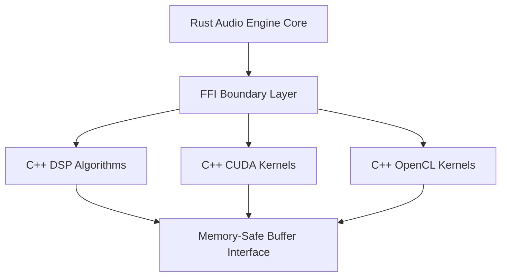

**Benefits**:
- Clear ownership and lifetime management
- Easier testing of individual components
- Reduced complexity in error propagation
- Better memory safety guarantees

### 2. GPU Backend Abstraction

**Current Issue**: GPU processor enum with optional backends creates runtime complexity and potential null pointer scenarios.

**Recommendation**: Use trait-based polymorphism with compile-time backend selection.

**Proposed Design Pattern**:

| Component | Current Approach | Improved Approach |
|-----------|-----------------|-------------------|
| Backend Selection | Runtime enum with Option types | Trait-based abstraction with feature flags |
| Memory Management | Manual tracking per backend | Unified memory pool interface |
| Error Handling | Backend-specific error types | Unified error enum with backend context |
| Performance | Runtime dispatch overhead | Static dispatch via traits |

**Architecture Benefits**:
- Eliminate runtime backend checking overhead
- Compile-time optimization opportunities
- Cleaner error handling paths
- Reduced binary size for single-backend builds

### 3. Real-time Processing Guarantees

**Current Issue**: No explicit design for deterministic real-time behavior and latency guarantees.

**Recommendation**: Implement priority-based processing architecture with latency budgets.

**Critical Components**:

| Layer | Latency Budget | Priority | Mitigation Strategy |
|-------|---------------|----------|---------------------|
| Audio I/O | < 5ms | Critical | Lock-free ring buffers |
| DSP Processing | < 10ms | High | Pre-allocated memory pools |
| GPU Transfer | < 3ms | High | Pinned memory with async DMA |
| UI Updates | < 16ms | Medium | Decoupled event system |
| File I/O | Best effort | Low | Background thread pool |

**Processing Flow Enhancement**:

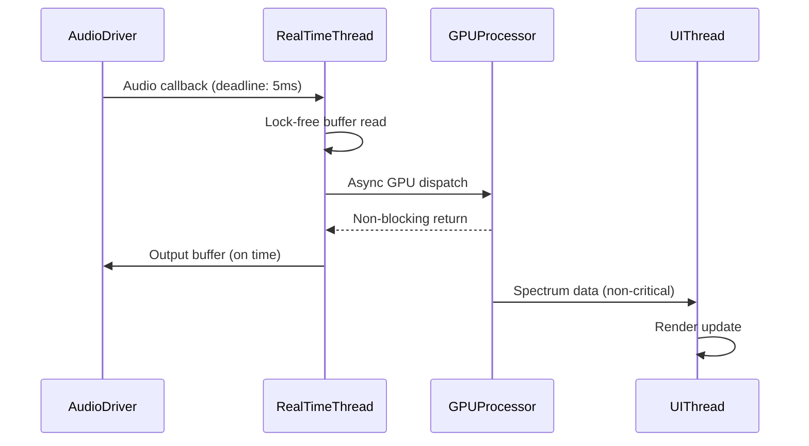

## Data Flow and State Management Issues

### 4. WebSocket Communication Pattern

**Current Issue**: WebSocket server embedded in the audio processing path may introduce latency and complexity.

**Recommendation**: Decouple monitoring data from critical audio path.

**Improved Architecture**:

| Aspect | Current Design | Improved Design |
|--------|---------------|-----------------|
| Data Collection | Synchronous from audio thread | Lock-free SPSC queue |
| Transmission | Direct WebSocket push | Batched updates with sampling |
| Update Frequency | Every audio callback | Configurable (30-60 Hz) |
| Backpressure | Blocking | Drop old frames |

**Communication Flow**:

### 5. State Synchronization Between Layers

**Current Issue**: Multiple state stores (Pinia) with Tauri commands may lead to state inconsistencies.

**Recommendation**: Implement event sourcing pattern with single source of truth.

**State Management Strategy**:

| State Type | Storage Location | Update Pattern | Synchronization |
|------------|-----------------|----------------|-----------------|
| Audio Engine Config | Rust (authoritative) | Command-based | Push to frontend on change |
| UI Preferences | Frontend (Pinia) | Local | Persist to backend periodically |
| Real-time Metrics | Transient (WebSocket) | Streaming | No persistence needed |
| Playback State | Rust (authoritative) | Event-driven | Immediate frontend notification |

## Performance and Scalability Concerns

### 6. Memory Management Strategy

**Current Issue**: Generic mention of memory pools without concrete implementation strategy.

**Recommendation**: Implement typed memory pool hierarchy with clear allocation policies.

**Memory Architecture**:

| Pool Type | Size | Allocation Strategy | Use Case |
|-----------|------|---------------------|----------|
| Audio Buffer Pool | 32 x buffer_size | Fixed-size, lock-free | Real-time audio I/O |
| GPU Transfer Pool | 4 x 16MB | Pinned memory, pre-allocated | Host-GPU transfers |
| Processing Scratch | 128MB per thread | Thread-local, reusable | DSP computation workspace |
| File Cache | Dynamic (256MB-2GB) | LRU eviction | Audio file buffering |

**Lifetime Management**:

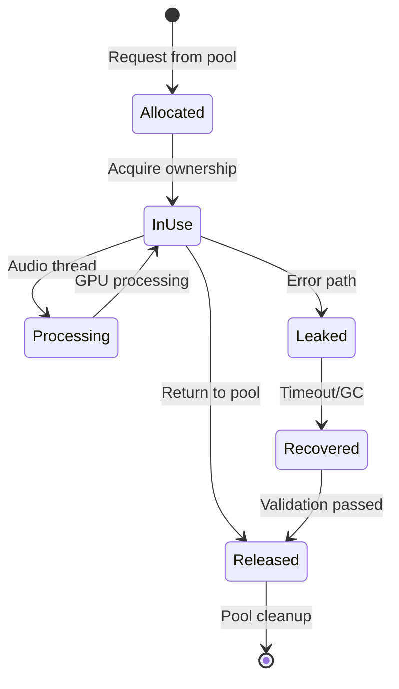

### 7. GPU Workload Distribution

**Current Issue**: No strategy for handling mixed CPU/GPU workloads or adaptive processing.

**Recommendation**: Implement dynamic workload scheduling based on processing cost analysis.

**Decision Matrix**:

| Processing Type | Sample Count | GPU Threshold | Recommended Path |
|----------------|--------------|---------------|------------------|
| EQ (512 bands) | < 4096 | Always GPU | CUDA/OpenCL/Vulkan |
| Convolution | < 1024 taps | CPU | Native SIMD |
| Convolution | 1024-16K taps | Hybrid | GPU for FFT, CPU for overlap-add |
| Convolution | > 16K taps | GPU | Full GPU pipeline |
| Resampling | Any | CPU | Optimized CPU SIMD |
| DSD conversion | Any | GPU | CUDA specialized kernels |

**Adaptive Scheduling Flow**:

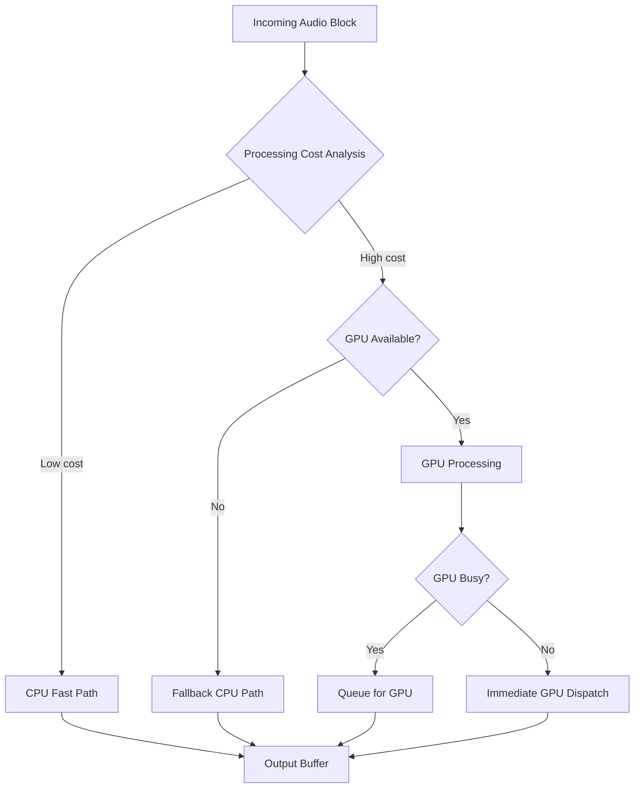

### 8. Filter Chain Processing Optimization

**Current Issue**: Sequential filter chain processing may not leverage parallelism opportunities.

**Recommendation**: Implement dependency graph analysis for parallel filter execution.

**Processing Modes**:

| Mode | Condition | Execution Strategy | Latency Impact |
|------|-----------|-------------------|----------------|
| Serial | Filters have data dependencies | Sequential execution | Additive latency |
| Parallel | Independent filters | Multi-threaded execution | Max single filter latency |
| GPU Fused | Compatible GPU operations | Single kernel launch | Minimal overhead |
| Hybrid | Mixed CPU/GPU filters | Pipelined execution | Overlapped processing |

**Dependency Graph Example**:

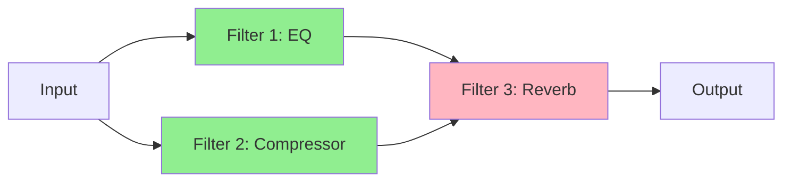

*Green filters can execute in parallel, pink must wait for dependencies*

## Maintainability and Testing Improvements

### 9. Testing Strategy Gaps

**Current Issue**: Test directory structure exists but no concrete testing methodology defined.

**Recommendation**: Define comprehensive testing strategy across all layers.

**Testing Hierarchy**:

| Test Level | Coverage Target | Tools | Critical Areas |
|------------|----------------|-------|----------------|
| Unit Tests | Individual functions | Rust: cargo test, TS: Vitest | DSP algorithms, buffer management |
| Integration Tests | Component interaction | Rust: integration tests, Tauri test harness | FFI boundaries, IPC communication |
| Performance Tests | Latency and throughput | Custom benchmarking tools | Real-time processing guarantees |
| System Tests | End-to-end workflows | Automated UI testing | File loading, playback, filter chains |
| Platform Tests | OS-specific behavior | CI/CD per platform | Audio driver interaction, GPU backends |

**Critical Test Scenarios**:

1. **Real-time Guarantee Testing**: Verify audio processing meets deadlines under load
2. **GPU Fallback Testing**: Ensure graceful degradation when GPU unavailable
3. **Memory Leak Testing**: Long-duration playback with filter chain modifications
4. **Format Compatibility**: Automated tests across all supported audio formats
5. **Platform Audio Drivers**: Native driver interaction on Windows/macOS/Linux

### 10. Error Handling and Recovery

**Current Issue**: Error types mentioned but no comprehensive error recovery strategy.

**Recommendation**: Implement layered error handling with automatic recovery mechanisms.

**Error Categories and Recovery**:

| Error Category | Severity | Recovery Strategy | User Impact |
|---------------|----------|-------------------|-------------|
| Audio Driver Failure | Critical | Attempt driver reset, fallback to alternative driver | Notification + auto-recovery |
| GPU Processing Failure | High | Fallback to CPU processing | Performance degradation warning |
| File Loading Error | Medium | Display error, continue with playlist | Error message, skip to next |
| Network Discovery Failure | Low | Retry with exponential backoff | Silent retry, log warning |
| UI Rendering Issue | Low | Component-level error boundary | Partial UI degradation |

**Error Propagation Pattern**:

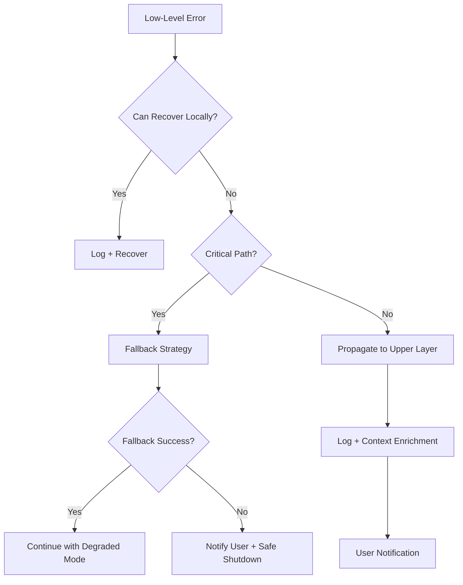

## Security and Privacy Enhancements

### 11. Input Validation and Sanitization

**Current Issue**: No explicit input validation strategy for file paths, filter parameters, or network data.

**Recommendation**: Implement defense-in-depth validation at every trust boundary.

**Validation Layers**:

| Input Type | Validation Points | Checks Required | Rejection Behavior |
|------------|------------------|-----------------|-------------------|
| File Paths | Tauri command + Rust loader | Path traversal, existence, permissions | Return error to frontend |
| Filter Parameters | Frontend + Tauri command + Engine | Range validation, type checking | Clamp to safe range + warning |
| Audio Files | Format detector + Decoder | Magic bytes, size limits, corruption | Graceful error + format details |
| Network Messages | WebSocket handler | Schema validation, rate limiting | Drop malformed messages |
| Device IDs | Output manager | Existence check, access validation | Fall back to default device |

### 12. Resource Limits and Quotas

**Current Issue**: No defined limits for resource consumption (memory, GPU, file size).

**Recommendation**: Establish and enforce resource quotas with monitoring.

**Resource Limit Configuration**:

| Resource | Default Limit | Configurable | Enforcement | Exceeded Behavior |
|----------|--------------|--------------|-------------|-------------------|
| Audio File Size | 2 GB | Yes | File loader | Reject with error |
| GPU Memory Usage | 80% of available | Yes | GPU memory manager | Fallback to CPU |
| Convolution IR Size | 16M samples | Yes | Convolution loader | Downsample + warning |
| Filter Chain Length | 32 filters | Yes | Chain manager | Reject addition |
| Playlist Size | 10,000 items | Yes | Playlist manager | Prevent addition |
| WebSocket Clients | 8 connections | Yes | Network manager | Reject new connections |

## Cross-Platform Consistency Issues

### 13. Platform-Specific Behavior Abstraction

**Current Issue**: Platform-specific code scattered across components without unified abstraction.

**Recommendation**: Centralize platform differences behind trait implementations.

**Platform Abstraction Strategy**:

| Platform Feature | Abstraction Approach | Implementation Location |
|-----------------|---------------------|-------------------------|
| Audio Drivers | AudioDriverTrait with platform impls | src-tauri/src/platform/audio/ |
| GPU Acceleration | GPUBackendTrait with feature flags | src-tauri/src/gpu/backends/ |
| File System | Use Tauri's platform-agnostic APIs | Built-in Tauri APIs |
| System Tray | Conditional compilation with unified API | src-tauri/src/platform/tray/ |
| Notifications | Platform notification trait | src-tauri/src/platform/notify/ |

**Configuration Management per Platform**:

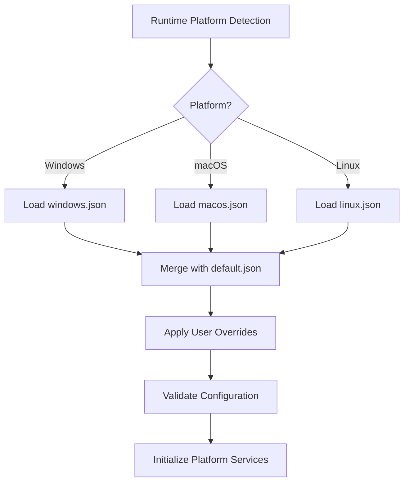

### 14. Audio Driver Prioritization Logic

**Current Issue**: Multiple audio driver options per platform without clear selection logic.

**Recommendation**: Implement priority-based driver selection with user override capability.

**Driver Selection Matrix**:

| Platform | Priority 1 | Priority 2 | Priority 3 | Fallback |
|----------|-----------|-----------|-----------|----------|
| Windows | WASAPI Exclusive | WASAPI Shared | DirectSound | System default |
| macOS | CoreAudio (Low Latency) | CoreAudio (Standard) | N/A | System default |
| Linux | JACK (if running) | PipeWire | ALSA | System default |

**Selection Algorithm**:

1. Check user preference in configuration
2. Attempt priority 1 driver initialization
3. On failure, log reason and try priority 2
4. Continue until successful or fall back to system default
5. Notify user of active driver and any initialization issues

## Documentation and Developer Experience

### 15. API Documentation Completeness

**Current Issue**: Code structure shown but missing comprehensive API contracts and behavior specifications.

**Recommendation**: Document all public APIs with contracts, examples, and edge cases.

**Documentation Requirements per Component**:

| Component Type | Required Documentation | Format | Examples Needed |
|---------------|------------------------|--------|-----------------|
| Tauri Commands | Parameter types, return types, error cases | Inline Rust docs | Minimum 2 per command |
| Audio Engine APIs | Preconditions, postconditions, threading model | Inline Rust docs | Complex scenarios |
| WebSocket Protocol | Message schemas, sequence diagrams | Markdown + JSON Schema | Each message type |
| Filter Interfaces | Parameter ranges, processing guarantees | Inline Rust docs + design doc | Implementation guide |
| Configuration Schema | All fields, defaults, validation rules | JSON Schema + markdown | Complete example configs |

### 16. Build and Development Workflow Clarity

**Current Issue**: Basic build commands shown but missing development workflow, dependency management, and troubleshooting.

**Recommendation**: Provide comprehensive developer onboarding documentation.

**Required Developer Documentation**:

1. **Environment Setup Guide**
   - Required tools and versions (Rust, Node.js, platform SDKs)
   - CUDA/OpenCL/Vulkan development kit installation
   - Platform-specific prerequisites

2. **Development Workflow**
   - Hot reload configuration for frontend and backend
   - Debugging setup for Rust and TypeScript
   - GPU debugging tools and techniques

3. **Dependency Management**
   - Explanation of major dependencies and their roles
   - Update policy and compatibility testing
   - Handling platform-specific dependencies

4. **Common Issues and Solutions**
   - Audio driver initialization failures
   - GPU backend compilation errors
   - Cross-compilation setup

## Scalability and Future-Proofing

### 17. Plugin System Architecture

**Current Issue**: Plugin system mentioned but without concrete architecture or loading mechanism.

**Recommendation**: Design formal plugin API with versioning and sandboxing.

**Plugin Architecture**:

| Aspect | Design Decision | Rationale |
|--------|----------------|-----------|
| Plugin Format | Dynamic libraries (Rust cdylib) | Native performance, type safety |
| API Versioning | Semantic versioning with compatibility checks | Prevent breakage |
| Sandboxing | Process isolation for untrusted plugins | Security and stability |
| Discovery | Plugin directory scanning + manifest validation | Automatic loading |
| Hot Reload | Support for plugin reload without restart | Development convenience |

**Plugin Interface Contract**:

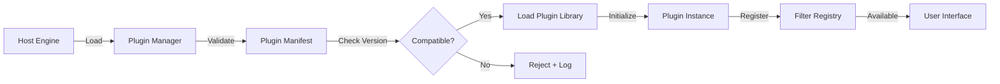

**Plugin Lifecycle States**:

- **Discovered**: Plugin found but not validated
- **Validated**: Manifest checked, version compatible
- **Loaded**: Dynamic library loaded into memory
- **Initialized**: Plugin initialization callback executed
- **Active**: Registered and available for use
- **Suspended**: Temporarily disabled by user
- **Unloaded**: Removed from memory

### 18. Cloud Synchronization Design

**Current Issue**: Cloud sync mentioned without architecture, data model, or conflict resolution.

**Recommendation**: Design optional cloud sync with privacy-first approach and conflict resolution.

**Synchronization Strategy**:

| Data Type | Sync Priority | Conflict Resolution | Privacy Level |
|-----------|--------------|-------------------|---------------|
| User Presets | High | Last-write-wins with timestamp | User-controlled |
| Filter Configurations | High | Manual merge with diff view | User-controlled |
| Playback History | Medium | Merge with deduplication | Opt-in only |
| System Settings | Low | Device-specific, no sync | Never synced |
| Audio Files | Not synced | N/A | Never synced |

**Sync Architecture**:

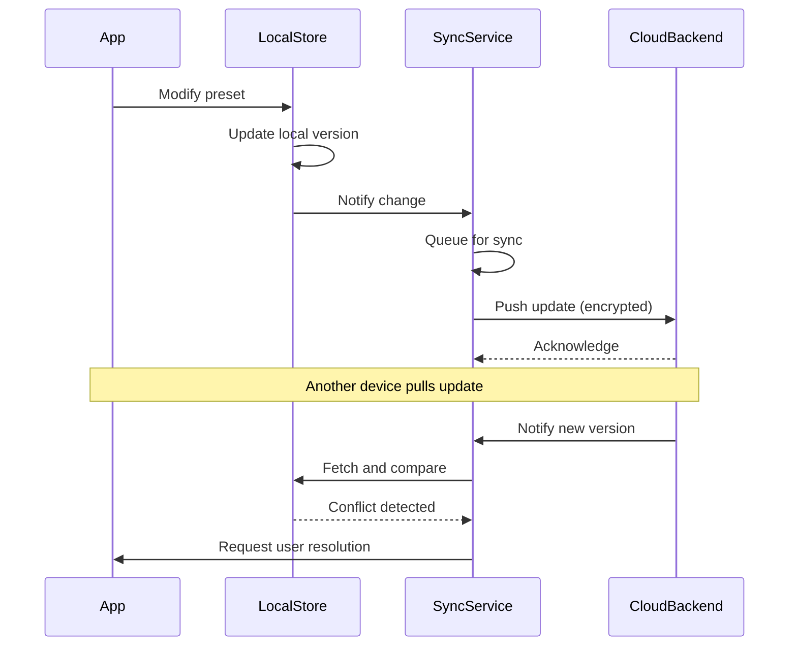

## Configuration and Deployment Improvements

### 19. Configuration Management Complexity

**Current Issue**: Multiple configuration files per platform without clear precedence or merging rules.

**Recommendation**: Implement hierarchical configuration with clear override semantics.

**Configuration Precedence** (highest to lowest):

1. Command-line arguments (for testing/debugging)
2. User configuration file (~/.vortex-gpu-audio/config.json)
3. Platform-specific defaults (assets/config/{platform}.json)
4. Global defaults (assets/config/default.json)

**Configuration Schema Structure**:

| Section | Purpose | User-Editable | Requires Restart |
|---------|---------|---------------|------------------|
| audio | Sample rate, buffer size, driver selection | Yes | Yes |
| gpu | Backend selection, memory limits | Yes | Yes |
| ui | Theme, language, window position | Yes | No |
| network | WebSocket port, device discovery | Yes | Yes |
| performance | Thread counts, optimization level | Advanced | Yes |
| diagnostics | Logging level, telemetry | Yes | No |

### 20. Installation and Update Mechanism

**Current Issue**: Deployment mentioned but no update mechanism or version migration strategy.

**Recommendation**: Implement auto-update system with rollback capability.

**Update Strategy**:

| Update Type | Trigger | User Action | Rollback Available |
|-------------|---------|-------------|-------------------|
| Critical Security | Automatic check | Prompt + recommend immediate | Yes |
| Feature Update | Scheduled check (weekly) | Optional, user-initiated | Yes |
| Beta Channel | Opt-in | User-initiated | Yes |
| Plugin Update | On plugin load | Automatic with notification | Per-plugin |

**Update Process Flow**:

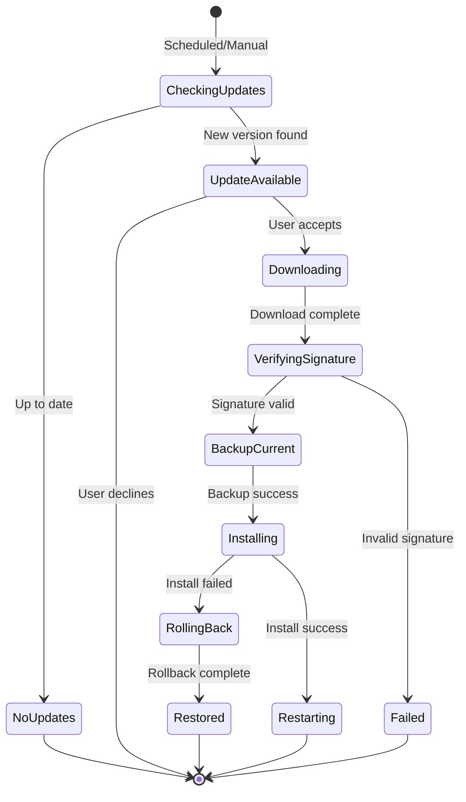

## Performance Monitoring and Profiling

### 21. Observability Infrastructure

**Current Issue**: Performance monitoring mentioned but without concrete metrics collection and analysis framework.

**Recommendation**: Implement structured observability with metrics, traces, and logs.

**Observability Stack**:

| Layer | Metrics Collected | Collection Method | Retention |
|-------|------------------|-------------------|-----------|
| Audio Processing | Callback latency, buffer underruns, processing time | Per-callback sampling | 1-minute rolling window |
| GPU Operations | Kernel execution time, memory transfers, occupancy | CUDA/OpenCL profiler API | Per-operation aggregation |
| System Resources | CPU/GPU utilization, memory usage, temperature | System APIs, polled every second | 5-minute rolling window |
| User Interactions | Command latency, error rates | Event logging | Session-based |

**Performance Dashboard Data Model**:

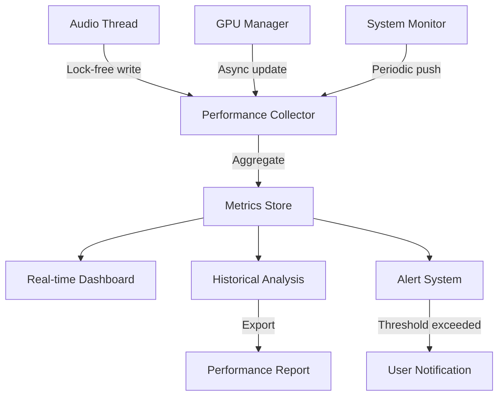

**Key Performance Indicators (KPIs)**:

- **Audio Quality**: Buffer underrun rate (target: 0 per hour)
- **Latency**: Round-trip latency (target: < 10ms at 48kHz)
- **GPU Efficiency**: GPU utilization during playback (target: 40-60%)
- **Memory Health**: Allocation failures (target: 0)
- **Reliability**: Crash-free runtime hours (target: > 1000 hours)

## Internationalization and Accessibility

### 22. Internationalization Beyond UI Strings

**Current Issue**: i18n covers UI strings but not audio metadata, error messages, or documentation.

**Recommendation**: Comprehensive i18n strategy covering all user-facing content.

**I18n Coverage Expansion**:

| Content Type | Current Coverage | Needed Coverage | Implementation |
|--------------|-----------------|-----------------|----------------|
| UI Labels | Yes (vue-i18n) | Complete | Already implemented |
| Error Messages | No | All user-facing errors | Rust i18n library |
| Audio Metadata | No | Genre, mood tags | Metadata translation database |
| Help Documentation | No | All help text | Markdown with language variants |
| Plugin Descriptions | No | Plugin manifests | Plugin i18n support |

### 23. Accessibility Features

**Current Issue**: No mention of accessibility considerations for users with disabilities.

**Recommendation**: Implement WCAG 2.1 Level AA compliance with audio-specific accessibility features.

**Accessibility Requirements**:

| Feature | Purpose | Implementation Approach |
|---------|---------|------------------------|
| Keyboard Navigation | Full app control without mouse | Vue focus management + shortcuts |
| Screen Reader Support | Non-visual interface access | ARIA labels + semantic HTML |
| High Contrast Mode | Visual impairment support | CSS variables + system theme detection |
| Adjustable Font Sizes | Vision accessibility | Scalable UI with rem units |
| Audio Feedback | Blind user operation | Optional audio cues for actions |
| Visual Alerts | Hearing impairment | Visual indicators for audio events |

## Recommended Implementation Priorities

### Phase 1: Critical Foundation (Weeks 1-4)

1. FFI abstraction layer for Rust/C++ boundary
2. Lock-free ring buffer implementation for real-time path
3. GPU backend trait abstraction
4. Basic error handling and recovery framework
5. Input validation at all trust boundaries

### Phase 2: Performance and Stability (Weeks 5-8)

6. Memory pool implementation
7. Real-time thread priority and latency optimization
8. GPU workload scheduling system
9. Comprehensive unit and integration tests
10. Performance monitoring infrastructure

### Phase 3: Developer Experience (Weeks 9-10)

11. API documentation completion
12. Developer onboarding guide
13. Platform-specific build and debug instructions
14. Troubleshooting guide

### Phase 4: Advanced Features (Weeks 11-12)

15. Plugin system architecture and API
16. Configuration management improvements
17. Auto-update mechanism
18. Internationalization expansion

### Phase 5: Polish and Optimization (Weeks 13-14)

19. Accessibility features
20. Cloud sync design (optional)
21. Performance profiling and optimization
22. User acceptance testing

## Risk Assessment

| Risk Area | Current Risk Level | Impact | Mitigation Priority |
|-----------|-------------------|--------|---------------------|
| Real-time Performance | High | Critical | Immediate |
| Memory Safety (FFI) | Medium | High | Immediate |
| Cross-Platform Consistency | Medium | Medium | Phase 1 |
| GPU Backend Fallback | Medium | High | Phase 2 |
| State Synchronization Bugs | Medium | Medium | Phase 2 |
| Plugin Security | Low | High | Phase 4 |
| Update Failures | Low | Medium | Phase 4 |

## Conclusion and Confidence Assessment

**Confidence Level**: Medium

**Confidence Basis**:
- The original design provides strong technical foundation and technology choices
- Critical gaps identified in real-time guarantees, error handling, and testing strategy
- Cross-platform complexity requires careful abstraction design
- GPU multi-backend support introduces significant implementation complexity
- Missing concrete specifications for several advanced features (plugins, cloud sync)

**Key Success Factors**:
1. Prioritize real-time audio processing guarantees above all else
2. Establish comprehensive testing before adding advanced features
3. Maintain clear separation between real-time and non-real-time code paths
4. Invest in developer tooling and documentation early
5. Implement phased rollout with extensive platform-specific testing

**Next Steps**:
- Review and prioritize improvement recommendations with development team
- Create detailed technical specifications for Phase 1 items
- Set up development environment and CI/CD pipeline
- Begin implementation following recommended priority order
